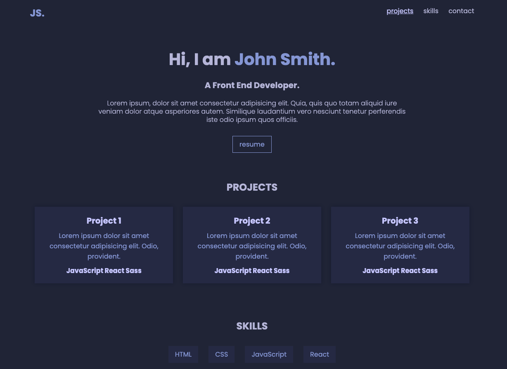

# Poject Simplefolio

- This project was created as part of a coding bootcamp.
- I created this project on the first day we learned about react
- The learning objective of the project:
- Create a React app with the help of the terminal
- Understand the basic principles of React by:

1. structuring and organizing a React page (Where are redundancies? Where can I reuse a component?)
2. creating multiple components (modular structure)
3. styling multiple components

## Demo Link

https://project-simplefolio-cecile.netlify.app

## Screenshots 📸

## Copatible Screensizes

- Desktop

## Tech Stack 💻

- react
- CSS
- vite
- GitHub
- netlify
- JavaScript
- GIT

## Author 🤵‍♀️

- [@cecilestaller](https://github.com/cecilestaller)
